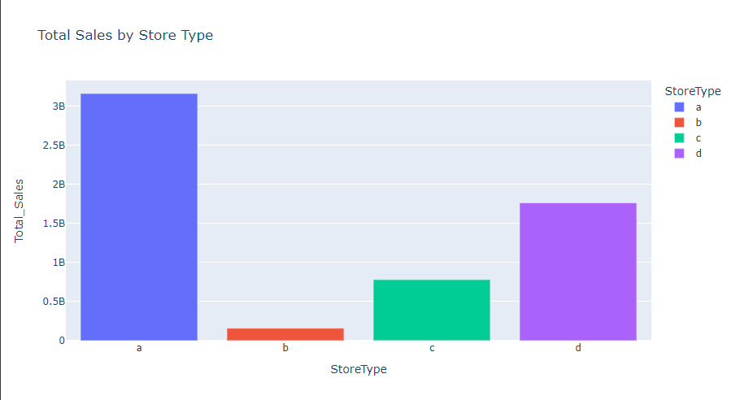
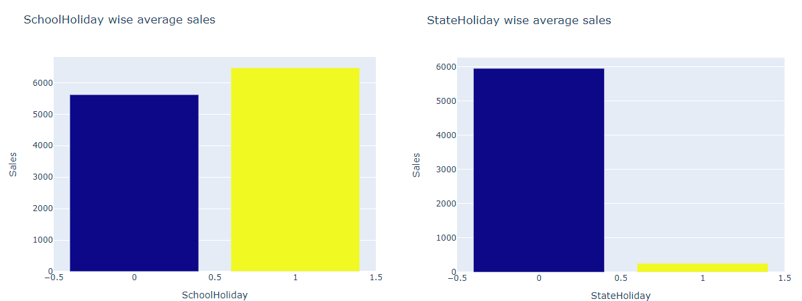
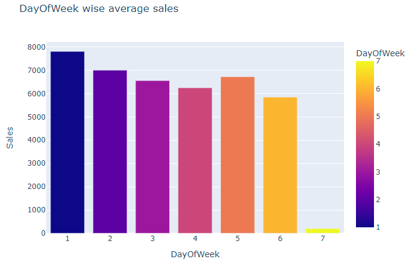
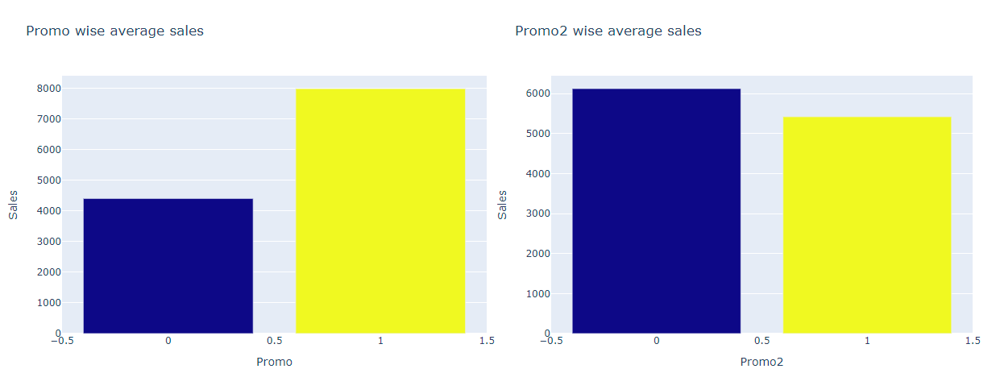
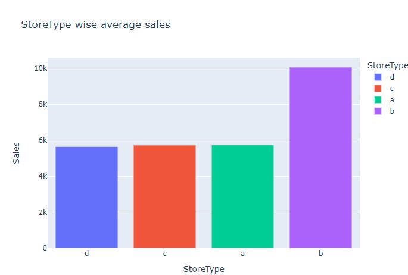
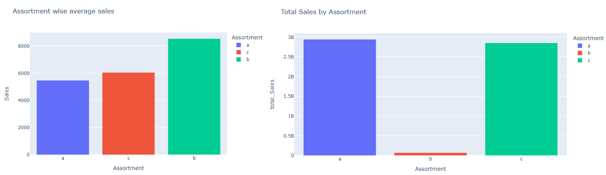

# Rossmann Retail Stores Sales

## Project Summary

### Data Features

- Store: The store ID.
- DayOfWeek: The day of the week (1-7, where 1 is Monday and 7 is Sunday).
- Date: The date of the sales record.
- Sales: The total sales for the given day and store.
- Customers: The number of customers on the given day and store.
- Open: Indicates whether the store was open (1) or closed (0) on the given day.
- Promo: Indicates whether a promotional offer was active (1) or not (0) on the given day.
- StateHoliday: Indicates whether the day was a state holiday (a, b, c) or not (0).
- SchoolHoliday: Indicates whether the day was a school holiday (1) or not (0).
- StoreType: The type of store (a, b, c, d).
- Assortment: The assortment level of the store (a = basic, b = extra, c = extended).
- CompetitionDistance: The distance to the nearest competitor store.
- CompetitionOpenSinceMonth: The month when the nearest competitor store opened.
- CompetitionOpenSinceYear: The year when the nearest competitor store opened.
- Promo2: Indicates whether a continuous promotional offer is active (1) or not (0).
- Promo2SinceWeek: The week of the year when the continuous promotional offer started.
- Promo2SinceYear: The year when the continuous promotional offer started.
- PromoInterval: The intervals at which the continuous promotional offer is repeated.

### Steps involved:

> Step 1: Data Understanding

> Step 2: Data preparation

> Step 3: Data Cleaning

> Step 4: Exploratory data analysis

### Libraries used

- Pandas
- Numpy
- Matplotib
- Seaborn
- Plotly
- Scipy

### Graphs used for representation:

- Bar plot
- Pie plot
- Box Plot
- Grouped bar plot
- Donut plot
- Heatmap
- Pair plot

### Insights from EDA impacting business:

1. The most selling and crowded store type is A.

2. More stores are opened during School holidays than State holidays.

3. Mondays have most sales since most of the Sundays are closed.

4. Promo 1 has given positive yields where as Promo 2 is a disaster.

5. Store type b has higher sales and customers per store than other store types.

6. Assortment b is available only at store type b and it has more sales and customers than any other assortment.

### Suggestions provided to increase the Sales:

1. There are very few B type stores, few more can be opened as average sales are quite high as compared to other types.
2. Assortment B is only available with store type B which can be extended to other types as well to cater the demands of customers.
3. Promo 2 should be discontinued and Promo 1 can be extended futher as it shows better results.
4. Very few stores are opened during State Holidays, so it suggested to open a subsequent amount of stores to serve in emergency purposes.